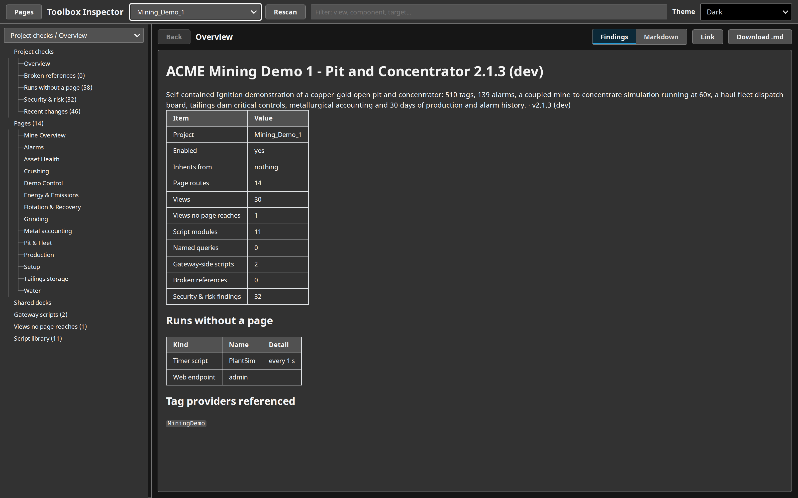
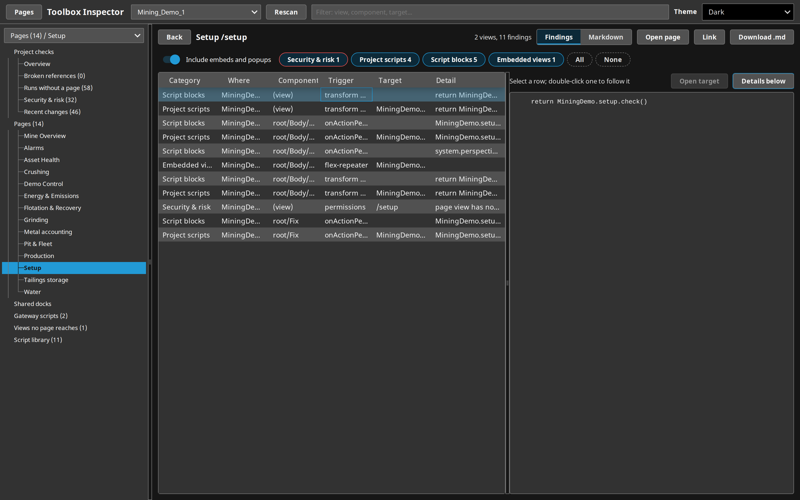
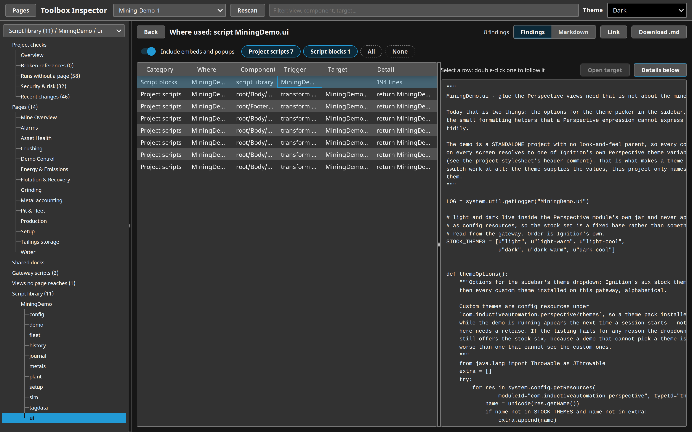
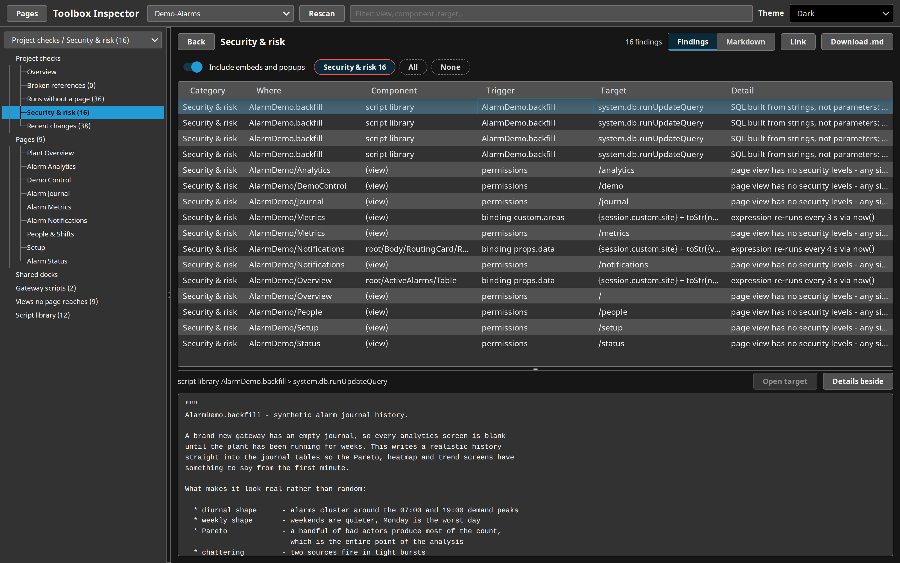
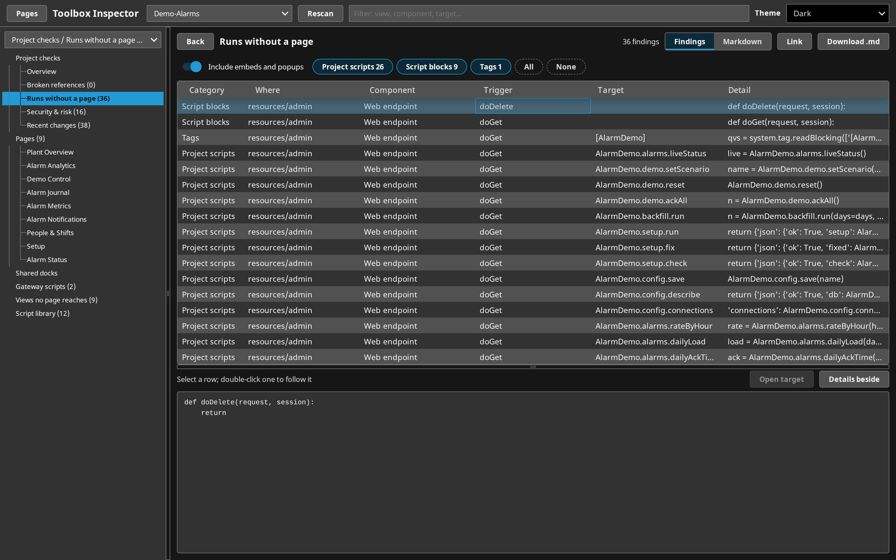

# Toolbox Inspector

A Perspective tool that explains any project on its gateway: what each page does, what breaks, what runs with no page open, and what is risky.

## Why this exists

Opening an unfamiliar Ignition project means clicking through views in the Designer to find out which button calls which API, which named queries a page needs, and which gateway scripts run on a timer behind everything. A large project has hundreds of views and thousands of scripts, bindings and calls, and a support engineer seeing it for the first time needs the answers in minutes, not days.

Toolbox Inspector reads the project live through the gateway's own project manager and lays it out page by page, with a switch per kind of finding. It also runs the checks that are hard to do by eye: references to things that do not exist, scripts that run with no page open, and security and performance risks.

## What it looks like

Pick a project and the Overview says what it is: page and view counts, what it inherits, the gateway scripts it runs, the modules its components need, the databases and tag providers it names. The tree lists the checks first, then every page.

A page with its findings, including the views it embeds and the popups it opens. The script pane sits beside the table here, for long scripts; one button puts it back below. The page list collapses to give the table the width.

Where used: every view, binding and script that calls a script module, with the module's code. Double-click any finding to follow it (to the view it opens, the page it goes to, or where its named query, script, message or tag is used), and Back retraces the steps.

Security & risk across the whole project, here SQL built by joining strings rather than passing parameters. Selecting a row shows the script it came from.

Runs without a page: every timer, scheduled, startup, tag-change and message script, Perspective session event and web endpoint, with what each one calls.

## What it does

| Check or view | What it shows |
| :-- | :-- |
| Overview | Title, description, parent project, counts, gateway scripts, API modules, components from third-party modules, databases and tag providers named. |
| Pages | Each route with everything its views do: API calls, named queries, SQL, project script calls, script blocks, navigation, popups and docks, messages, embedded views, tags. |
| Broken references | Named queries, views, script functions and page routes that are referenced but do not exist; tag paths with no tag on this gateway; messages sent that nothing handles, and handlers nothing sends to. |
| Runs without a page | Gateway timer, scheduled, startup, shutdown, tag-change and message scripts, Perspective session events and web endpoints. The 8.1 binary event-script format is decoded approximately. |
| Security & risk | Hard-coded private keys, tokens and passwords (value never shown), SQL built from strings, QueryString parameters in named queries, `system.util.execute`/`exec`/`eval`, pages with no view security, bindings that re-run faster than every 5 s and queries faster than every 30 s. |
| Recent changes | The last 200 resource edits, newest first, with who made them. |
| Views no page reaches | Views that no route, dock, embed or popup reaches by a fixed path. A view opened by a bound path shows here too. |
| Where used | For a named query, script module or function, view, message type or tag: its definition, then everything that uses it. |
| All projects (triage) | One row per project on the gateway: pages, views, broken references, risks, gateway scripts and last change. The first run scans every project. |

A script-library function counts as an API call if it makes an HTTP call itself or calls a function that does. The tag check covers literal paths in tag bindings and tag reads and writes; a path with no provider is checked against the project's default provider. Every node exports as Markdown, on screen or as a `.md` download. The page follows the session theme, and the theme list shows the themes installed on the gateway.

## How to use it

1. Import the release zip on an 8.3 gateway (Config > Projects > Import).
2. Open `/data/perspective/client/Toolbox_Inspector`.
3. Choose a project from the list at the top. The first scan of a large project takes a few seconds; after that it is cached for five minutes, or until Rescan. Rescan also picks up projects imported since the page opened.
4. Link gives a URL to the project and page on screen, for a ticket or a colleague: `/data/perspective/client/Toolbox_Inspector/<project>/<item>`. Open page opens the page itself in the inspected project.

It needs nothing else: no database, no tag provider, no gateway settings. It reads other projects and changes nothing. Disabled projects can be inspected too.

## Project layout

| Path | What it is |
| :-- | :-- |
| `ignition/script-python/inspector/scan` | The scanner and every check. Plain Python that runs under Jython 2.7 and CPython 3. |
| `ignition/script-python/inspector/source` | Reads a project through the gateway's project manager, caches the result, and serves the page's bindings. |
| `com.inductiveautomation.perspective/views/Inspector` | The page. |
| `com.inductiveautomation.perspective/views/ThemeDropdown` | The theme list, copied from the themes project. |
| `tools/package.sh` | Builds the release zip. |

Licensed Apache-2.0, see [LICENSE](LICENSE).
